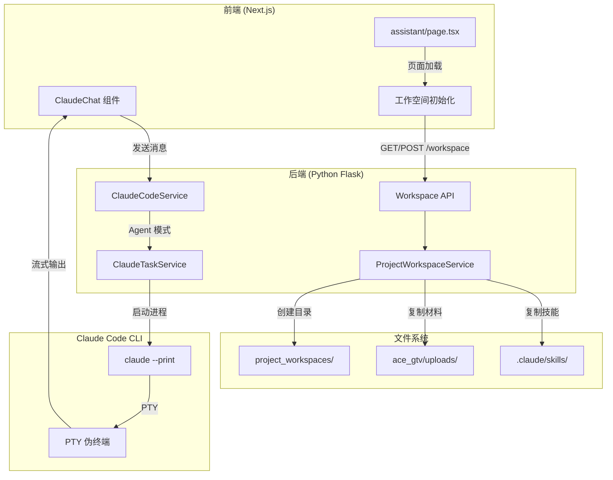
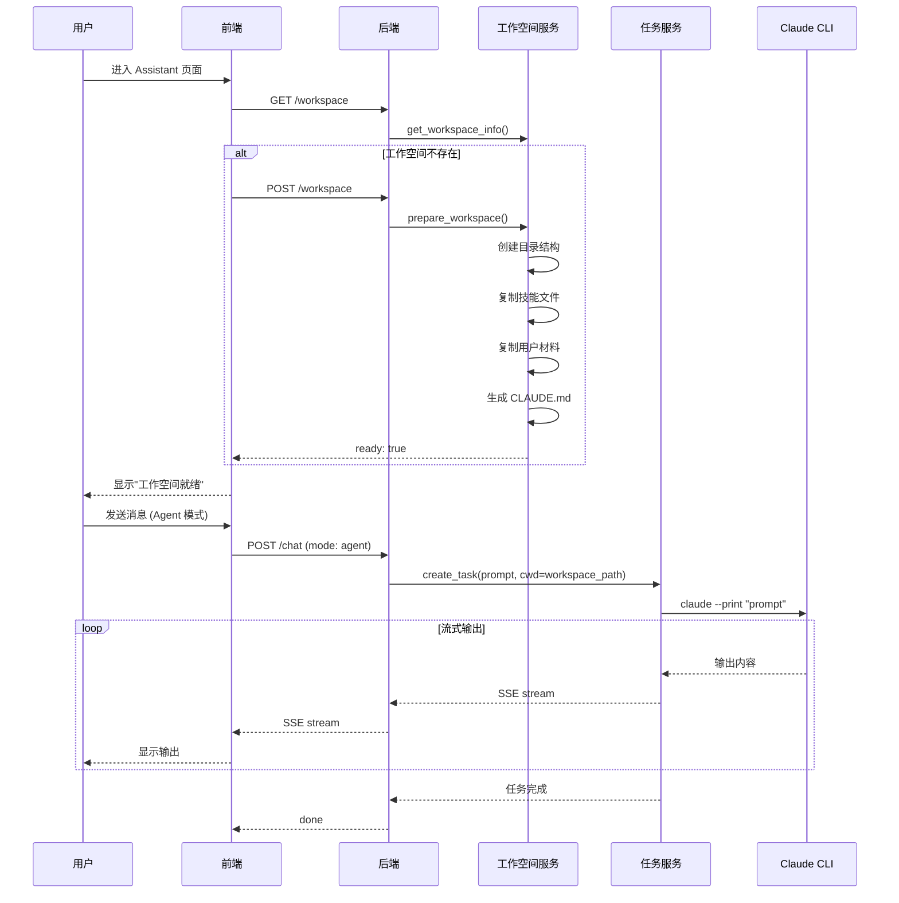

# Claude Code 项目工作空间技术设计文档

## 概述

本文档描述了 Claude Code Agent 模式的项目工作空间架构设计，包括自动初始化流程、文件结构、以及与前端的集成方式。

## 架构图



## 工作空间结构

每个项目在 `project_workspaces/{project_id}/` 下有独立的工作目录：

```
project_workspaces/
└── E6CFB79B/                    # 项目 ID
    ├── CLAUDE.md                # 项目上下文文件（Claude 自动读取）
    ├── README.md                # 项目说明
    ├── materials/               # 用户上传的原始材料
    │   ├── raw_materials/
    │   │   ├── folder_1/
    │   │   │   ├── resume.pdf
    │   │   │   ├── certificates.pdf
    │   │   │   └── ...
    │   │   └── folder_6/
    │   │       └── recommendation_letters.docx
    │   └── ...
    ├── documents/               # 生成的文档
    │   ├── personal_statement.md
    │   ├── cover_letter.md
    │   └── ...
    ├── output/                  # Claude 输出结果
    └── .claude/                 # Claude 配置
        └── skills/              # 技能文件
            ├── document-processing/
            │   └── SKILL.md
            ├── evidence-validation/
            │   └── SKILL.md
            ├── gtv-eligibility-assessment/
            │   └── SKILL.md
            ├── recommendations-generation/
            │   └── SKILL.md
            ├── resume-analysis/
            │   └── SKILL.md
            └── scoring-calculation/
                └── SKILL.md
```

## 自动初始化流程

### 1. 前端触发

当用户进入 `http://localhost/copywriting/{projectId}/assistant` 页面时，前端自动调用初始化：

```typescript
// app/copywriting/[projectId]/assistant/page.tsx

const initWorkspace = useCallback(async () => {
  // 1. 检查工作空间状态
  const checkResult = await apiCall(`/projects/${projectId}/workspace`)
  
  if (checkResult.success && checkResult.data?.ready) {
    setWorkspaceReady(true)
    return
  }
  
  // 2. 工作空间不存在或未就绪，自动初始化
  const initResult = await apiCall(`/projects/${projectId}/workspace`, {
    method: 'POST',
    body: JSON.stringify({ copy_uploads: true })
  })
  
  if (initResult.success) {
    setWorkspaceReady(true)
  }
}, [projectId])

useEffect(() => {
  if (projectId) {
    initWorkspace()  // 自动初始化
  }
}, [projectId, initWorkspace])
```

### 2. 后端处理

工作空间服务执行以下步骤：

```python
# ace_gtv/services/project_workspace_service.py

def prepare_workspace(self, project_id, project_info, copy_uploads=True):
    """
    一站式准备项目工作空间
    
    1. 创建目录结构
    2. 复制技能文件 (.claude/skills/)
    3. 复制用户上传的材料 (materials/)
    4. 生成 CLAUDE.md 项目上下文
    5. 生成 README.md
    """
    
    # 创建目录结构
    workspace_path = self.get_workspace_path(project_id)
    workspace_path.mkdir(parents=True, exist_ok=True)
    
    (workspace_path / "materials").mkdir(exist_ok=True)
    (workspace_path / "documents").mkdir(exist_ok=True)
    (workspace_path / "output").mkdir(exist_ok=True)
    (workspace_path / ".claude" / "skills").mkdir(parents=True, exist_ok=True)
    
    # 复制技能文件
    self._copy_skills(workspace_path)
    
    # 生成项目上下文
    self._generate_claude_md(workspace_path, project_id, project_info)
    
    # 复制用户材料
    if copy_uploads:
        self.copy_materials(project_id, from_upload_dir=True)
    
    return self.get_workspace_info(project_id)
```

### 3. CLAUDE.md 生成

自动生成的项目上下文文件：

```markdown
# 项目上下文

## 项目信息
- **项目ID**: E6CFB79B
- **客户名称**: 李先生
- **项目类型**: GTV签证申请
- **创建时间**: 2026-02-03 16:04:00

## 目录结构
- `materials/` - 用户上传的原始材料（简历、推荐信、证书等）
- `documents/` - 生成的文档（个人陈述、申请信等）
- `output/` - Claude 的输出结果

## 工作指南

### 材料分析
当分析 materials/ 目录中的文件时，请：
1. 识别文件类型（简历、推荐信、证书等）
2. 提取关键信息
3. 评估与 GTV 签证要求的匹配度

### 文档生成
当生成文档时，请：
1. 基于 materials/ 中的材料
2. 遵循 .claude/skills/ 中的技能指南
3. 输出到 documents/ 目录

## 可用技能
- **document-processing**: 文档处理技能
- **evidence-validation**: 证据验证技能
- **gtv-eligibility-assessment**: GTV资格评估技能
- **recommendations-generation**: 建议生成技能
- **resume-analysis**: 简历分析技能
- **scoring-calculation**: 评分计算技能
```

## API 接口

### 获取工作空间信息

```
GET /api/copywriting/projects/{project_id}/workspace
```

响应：
```json
{
  "success": true,
  "data": {
    "exists": true,
    "project_id": "E6CFB79B",
    "path": "/path/to/project_workspaces/E6CFB79B",
    "materials_count": 23,
    "documents_count": 0,
    "has_claude_md": true,
    "skills": ["document-processing", "evidence-validation", ...],
    "ready": true
  }
}
```

### 准备工作空间

```
POST /api/copywriting/projects/{project_id}/workspace
Content-Type: application/json

{
  "force": false,        // 是否强制重建
  "copy_uploads": true   // 是否复制上传的文件
}
```

响应：
```json
{
  "success": true,
  "message": "工作空间已准备就绪",
  "data": {
    "exists": true,
    "ready": true,
    "skills": [...],
    "materials_count": 23,
    "copy_result": {
      "copied": ["file1.pdf", "file2.docx", ...],
      "errors": [],
      "total": 23
    }
  }
}
```

### 清理工作空间

```
DELETE /api/copywriting/projects/{project_id}/workspace
```

### 复制材料到工作空间

```
POST /api/copywriting/projects/{project_id}/workspace/materials
Content-Type: application/json

{
  "source_files": ["/path/to/file1.pdf", "/path/to/file2.docx"]  // 可选
}
```

## Agent 模式执行流程



## 配置说明

### 目录配置

工作空间服务通过 `ProjectWorkspaceService` 类初始化时设置：

```python
# 项目根目录（通过文件位置推断）
project_root = Path(__file__).parent.parent.parent

# 工作空间根目录
base_workspace_dir = project_root / "project_workspaces"

# 技能源目录
skills_source_dir = project_root / ".claude" / "skills"

# 用户上传目录
uploads_dir = project_root / "ace_gtv" / "uploads"
```

### 环境变量

Claude Code 任务服务使用以下环境变量：

```bash
# Anthropic API 配置
ANTHROPIC_BASE_URL=https://api.moonshot.cn/anthropic
ANTHROPIC_AUTH_TOKEN=sk-xxx
ANTHROPIC_MODEL=kimi-k2-thinking-turbo
```

## UI 状态指示

前端显示工作空间状态：

```tsx
{/* 工作空间状态指示器 */}
{useClaudeCode && (
  <Badge 
    variant="outline" 
    className={workspaceReady 
      ? 'border-green-300 bg-green-50 text-green-700' 
      : 'border-yellow-300 bg-yellow-50 text-yellow-700'
    }
  >
    {workspaceReady ? '工作空间就绪' : '准备中...'}
  </Badge>
)}
```

## 思考过程和工具调用显示

### 流式输出格式

使用 `claude --print --output-format stream-json --include-partial-messages` 获取完整的思考过程和工具调用信息。

### 消息类型

| 类型 | 说明 | UI 显示 |
|------|------|---------|
| `thinking_start` | 思考开始 | 💭 **思考中...** |
| `thinking` | 思考过程增量 | *斜体灰色文本* |
| `tool_start` | 工具调用开始 | 🔧 **工具调用: ToolName** |
| `tool_input` | 工具输入增量 | `代码块` |
| `tool_call` | 完整工具调用 | JSON 格式显示 |
| `tool_result` | 工具执行结果 | 📋 **结果:** |
| `text` | 文本输出 | 普通文本 |
| `result` | 最终结果 | 最终内容 |

### 输出示例

```
[系统] 任务已创建: task_abc123
[系统] 任务开始执行...

💭 **思考中...**
*让我先分析一下当前目录的结构...*
*我需要使用 Bash 工具来列出文件...*

🔧 **工具调用: Bash**
```json
{
  "command": "ls -la materials/"
}
```

📋 **结果:**
total 48
drwxr-xr-x  5 user  staff   160 Feb  3 16:00 .
drwxr-xr-x  8 user  staff   256 Feb  3 16:00 ..
-rw-r--r--  1 user  staff  1234 Feb  3 16:00 resume.pdf

根据目录结构分析，这是一个 GTV 签证申请项目...
```

### 实现细节

```python
# claude_task_service.py - 处理 stream-json

def _process_stream_json(self, task_id, buffer, task):
    for line in buffer.split('\n'):
        event = json.loads(line)
        event_type = event.get("type")
        
        if event_type == "content_block_delta":
            delta = event.get("delta", {})
            delta_type = delta.get("type")
            
            if delta_type == "thinking_delta":
                # 推送思考内容
                self._push_output(task_id, {
                    "type": "thinking",
                    "content": delta.get("thinking", ""),
                })
            
            elif delta_type == "text_delta":
                # 推送文本内容
                self._push_output(task_id, {
                    "type": "text",
                    "content": delta.get("text", ""),
                })
```

## 注意事项

1. **隔离性**：每个项目有独立的工作空间，Claude Code 在该目录下运行，不会影响其他项目
2. **自动初始化**：页面加载时自动检查并初始化工作空间，无需用户手动操作
3. **材料同步**：用户上传的材料会自动复制到工作空间的 `materials/` 目录
4. **技能继承**：全局技能文件会复制到每个项目的 `.claude/skills/` 目录
5. **上下文注入**：`CLAUDE.md` 文件提供项目上下文，Claude 会自动读取

## 未来改进

1. **增量同步**：当用户上传新材料时，自动同步到工作空间
2. **工作空间清理**：定期清理不活跃的工作空间
3. **多用户隔离**：支持多用户同时使用不同项目的工作空间
4. **版本控制**：对工作空间中的文档变更进行版本控制
